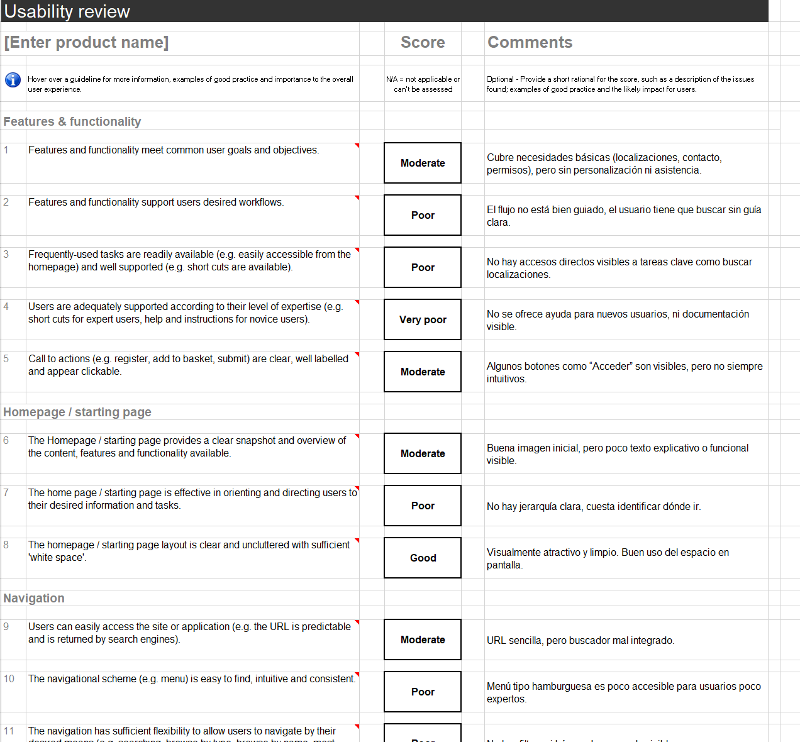

# DIU25  
**Trabajo Final - Diseño de Interfaces de Usuario**  
**Tema: Turismo Cinematográfico - Granada Film Commission**

Grupo: **DIU3.OSCUROS**  
Curso: 2024/25  

Miembros:
- 👤 Ignacio Rojas Valenzuela [:octocat:](https://github.com/tuusuario)

> Este repositorio contiene el trabajo individual del Caso de Estudio propuesto en la evaluación final de DIU. A través de un enfoque basado en UX/UI, se ha trabajado sobre la web real de Granada Film Commission para proponer una solución centrada en el usuario con aplicación al turismo cultural local.

---

## 🧭 Apartado a) Análisis de usabilidad de Granada Filmin

Se ha evaluado exhaustivamente la web oficial de [Granada Film Commission](https://filmgranada.com/), aplicando una plantilla estructurada de revisión de usabilidad.

📄 Documento base usado: `P5/Usability-review.xls`  
📸 Vista previa:

**Valoración estimada:** 58/100  
> La web tiene un diseño atractivo, pero muestra problemas en navegación, adaptabilidad móvil, y accesibilidad básica (etiquetas, contraste, jerarquía).

---

## ⚖️ Apartado b) Comparativa con Valencia Film Office

Se ha realizado una comparación objetiva entre la web de Granada y la de [València Film Office](https://valenciafilmoffice.org/), analizando estructura, diseño, navegación y accesibilidad.

📄 Documento: `P5/Competitor Analysis [DIU23] (Copy) (1).pdf`  
📸 Vista previa:

 (1)-1.png)

> Valencia Film Office destaca por su navegación clara, mejor jerarquía visual y mejor adaptación móvil. Granada Filmin resulta más impactante visualmente pero menos estructurada.

---

## 🎯 Apartado c) Propuesta de valor + App Granada CineRuta

### 📌 Scope Canvas

Se ha desarrollado una propuesta UX completa usando la herramienta Scope Canvas para definir las necesidades, acciones, objetivos y métricas de una app orientada a turismo cinematográfico local.

📄 Documento: `P5/Scope Canvas (Community) (Copy).pdf`  
📸 Vista previa:

 (Copy)-1.png)

---

### 📲 Boceto de la App (hecho a mano)

Se han definido 3 pantallas clave para el prototipo de la App **“Granada CineRuta”**:  
1. Pantalla de Inicio  
2. Pantalla de Ruta/Localización  
3. Pantalla de Reseña

📄 Documento: `P5/finalbocetos.png`  
📸 Vista previa:

> La app permite explorar rutas de cine, consultar películas rodadas, leer y publicar reseñas, y seguir itinerarios temáticos por localizaciones reales.

---

## 🧠 Apartado d) Autoevaluación y reflexión

A través de este caso de estudio he podido aplicar gran parte de lo trabajado en las prácticas: análisis heurísticos, prototipado, arquitectura de la información y diseño centrado en el usuario.

📄 Documento: `P5/autoevaluacion.pdf`  
📸 Vista previa:

> Me hubiera gustado haber incluido validaciones con usuarios reales o entrevistas en profundidad. Aun así, me siento mucho más preparado para abordar proyectos UX reales.

---

## 📂 Estructura de carpeta `P5/`

